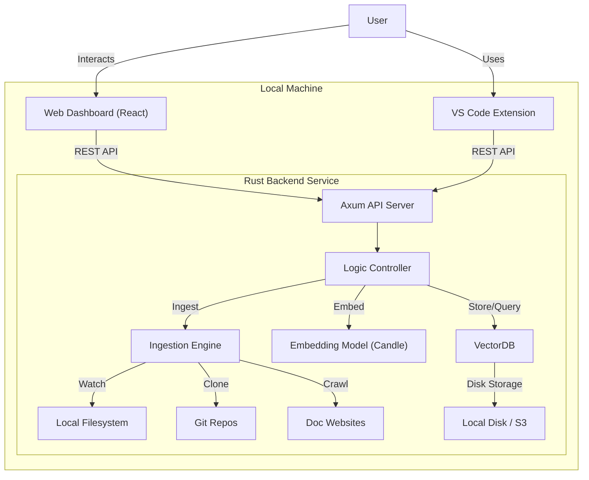

# Linggen Framework Architecture

## High-Level Architecture

The system consists of a Rust backend service that handles data ingestion, embedding generation, and vector storage (LanceDB). A React frontend provides the user interface, and external tools (VS Code, Chat Apps) connect via REST API.

## Components

### 1. API Server (Axum)

- Exposes REST endpoints for `query`, `ingest`, `status`.
- Handles WebSocket connections for real-time indexing updates.

### 2. Ingestion Engine

- **File Watcher**: Uses `notify` crate to watch for file changes.
- **Git Indexer**: Uses `git2` to read repository history.
- **Web Crawler**: Uses `spider` or `reqwest` to fetch documentation.

### 3. Vector Store (LanceDB)

- Embedded, serverless vector database.
- Stores embeddings and metadata on the local disk.
- Supports hybrid search (Vector + Full Text).

### 4. Embedding Model

- Runs locally using `candle` (HuggingFace Rust ecosystem).
- Default model: `all-MiniLM-L6-v2` (fast, lightweight).
