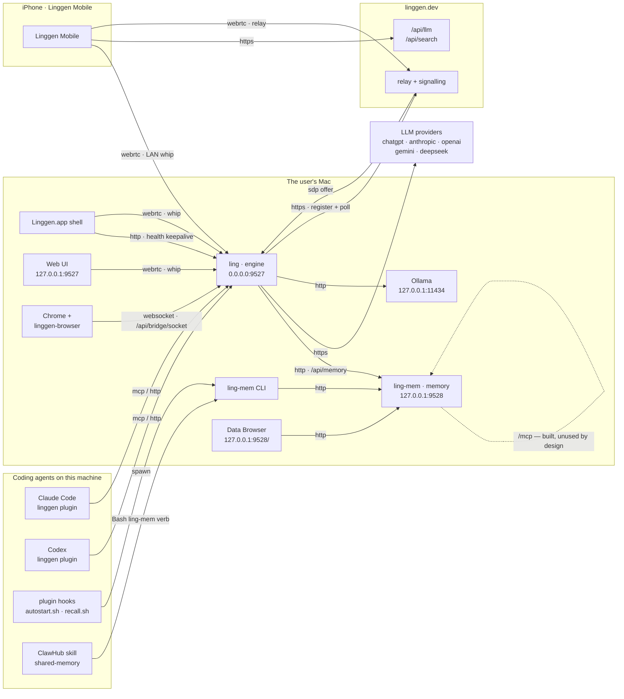
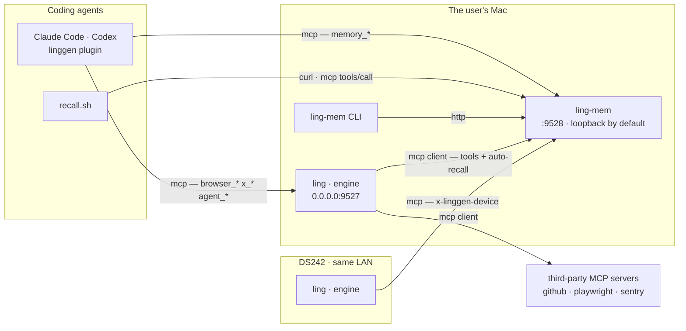

# Linggen network — who talks to whom

Two daemons on the user's machine, and everything else is a client of one of
them. Every edge below is in the shipped code; the transport on each arrow is
what actually runs, not what could.

## Where this is going

Decided 2026-07-29, not built — see `mcp-client-spec.md`. `ling` becomes an
MCP **client**, `ling-mem` becomes the one memory server, and `memory_*`
leaves the engine's front door so no tool is served twice.

What changes from the diagram above:

- **`ling` gains a client.** Today it can only be driven by MCP; here it
  consumes any server the user adds, and reaches memory the same way.
- **`memory_*` leaves `ling`'s `/mcp`.** The plugin wires two servers, each
  tool served in exactly one place.
- **Auto-recall goes over MCP too** — a tool *call* needs no model, only a
  client — so recall works across machines with the same code.
- **A second machine talks to `ling-mem` directly**, gated by the same
  `x-linggen-device` token store both daemons already share. `ling-mem` still
  binds loopback unless explicitly opened, and refuses to open without that
  token file.
- **`recall.sh` moves to MCP too.** A hook can't *be* a model's tool call,
  but it can *make* one — `curl` posting JSON-RPC. That is what lets a second
  machine's Claude Code recall from this store with **no `ling-mem` binary at
  all**: the CLI resolves through `daemon.json`, which only ever describes a
  local daemon.

## The two daemons

| | `ling` (engine) | `ling-mem` (memory) |
|:--|:--|:--|
| Binds | `0.0.0.0:9527` | `127.0.0.1:9528` |
| Address from | `~/.linggen/config/linggen.runtime.toml` `[server]` | compiled `daemon::DEFAULT_PORT`, or `--port` |
| Publishes where it bound | — | `~/.linggen/memory/linggen-memory/daemon.json` |
| Started by | `Linggen.app` shell (LaunchAgent), `--idle-shutdown-secs 300` | `ling-mem start`, plugin autostart, or first CLI use |
| Outbound | LLM providers, `linggen.dev` relay | none — embeddings run in-process |

The asymmetry is the source of most address bugs: **the one with a config file
publishes no discovery, and the one with discovery has no config file.** A
client of `ling` must guess its port; a client of `ling-mem` can read it but
cannot point it elsewhere.

## Edges

**Into `ling` (`:9527`)**

| From | Transport | Path |
|:--|:--|:--|
| Claude Code / Codex plugin | HTTP MCP, JSON-RPC | `/mcp` |
| Linggen.app shell | HTTP | `/api/health`, every 60s while a window is open |
| Shell, Web UI, phone on LAN | WebRTC | `/api/rtc/token` → `/api/rtc/whip` |
| Phone off LAN | WebRTC over relay | `linggen.dev` signalling → `/api/signaling/<nonce>/answer` |
| linggen-browser extension | WebSocket, extension dials in | `/api/bridge/socket` |
| Skills reaching the browser | HTTP | `POST /api/bridge/call` |

**Into `ling-mem` (`:9528`)**

| From | Transport | Path |
|:--|:--|:--|
| `ling` | HTTP REST | `POST /api/memory/<verb>`, URL from `[agent].ling_mem_url` |
| `ling-mem` CLI | HTTP REST | port read from `daemon.json` |
| Plugin hooks | spawn the CLI | `ling-mem search`, `days`, `status`, `start` |
| ClawHub `shared-memory` skill | spawn the CLI | `Bash ling-mem <verb>` — every op, no exception |
| Browser | HTTP | `/` — the Data Browser UI |

### Four front doors to one store

| Caller | Route | Needs the engine? |
|:--|:--|:--|
| Outside agent via the plugin | `/mcp` → `call_memory_http` → REST | yes |
| Linggen's own agents | `Memory_query` / `Memory_write` → REST | yes |
| ClawHub skill, plugin hooks, any agent with Bash | `ling-mem` CLI → REST | **no** |
| `ling-mem`'s own `/mcp` | direct | no — but unused, see below |

The CLI route is the engine-free channel and the reason it exists: a ClawHub
user installs the skill, the skill installs the binary (`install-bin.sh
--version '^1'`), and memory works with no `ling` on the machine at all. The
same `SKILL.md` also lists `Memory_query`/`Memory_write` in `allowed-tools`,
but that block is Linggen-only — "Claude Code / Codex ignore this block" — so
one skill file takes the engine route on Linggen and the CLI route everywhere
else.

Worth holding next to the `mcp-spec.md` line that the engine is the base
install for every channel: for the ClawHub channel today, it isn't.

**Out of the Mac**

| From | To | Why |
|:--|:--|:--|
| `ling` | provider APIs, `linggen.dev/api/llm`, local Ollama | inference |
| `ling` | `linggen.dev` | register the instance, poll for SDP offers |
| Phone | `linggen.dev/api/llm`, `/api/search` | Yinyue's model and web search |

Everything else the phone does — skills, memory, DJ files, photos, Ling's
chat — is tunnelled inside the WebRTC data channel as `http_request`, so it
works identically on the LAN and over the relay.

## One MCP, on purpose

`ling-mem` serves its own `/mcp` with 13 tools, and nothing of ours connects
to it. It is **superseded as the promoted path, frozen as public API, and
still maintained** — three separate facts, easily confused:

- It was built for outside agents first (`3df4919`, 2026-05-27: "HTTP endpoint
  serving 5 memory tools to CC/Codex/Cursor") — six weeks *before* the engine
  had a `/mcp` at all.
- `mcp-spec.md` (2026-07-10) then chose one front door for every channel, so
  the engine's `/mcp` became the promoted one. That decided which we *promote*,
  not that this one is dead.
- 1.0.0 froze "the CLI / HTTP / **MCP** API surface" — removing it is a 2.0.
  It is still being fixed (`memory_update` and `memory_harvest_day` exposed;
  an `episodic` table-scope bug in `memory_search`).

Whether anyone is on it is unknown — no telemetry, and it isn't advertised in
the README or on the site. It shipped stable on 2026-05-27 and has been in
every release since.

Consequence: memory reaches an outside agent by the long route —
`agent → ling /mcp → HTTP REST → ling-mem` — and the dispatch-normalisation
step exists in both repos (`ling-mem` `src/http/mcp.rs` says its
`apply_dispatch_fixes` are "ported from" the engine's `memory_tool.rs`).

## Where an address comes from, today

| Consumer | Reads | Overridable |
|:--|:--|:--|
| `ling` server bind | `linggen.runtime.toml` `[server]` | yes |
| plugin `.mcp.json` | hardcoded `127.0.0.1:9527` | **no** |
| plugin `autostart.sh` | `LINGGEN_PORT`, default `9527` | env only |
| `ling` → `ling-mem` | `[agent].ling_mem_url` | yes |
| `ling` `cli/status.rs` | `DEFAULT_LING_MEM_PORT` const | **no** — ignores the above |
| `ling` permission check | hardcoded `127.0.0.1:9528` | **no** |
| `ling-mem` CLI | `daemon.json` | n/a — discovery |
| `linggen-vscode` | its own `linggen.dashboard.port` | yes |

`linggen/src/config.rs` carries `DEFAULT_LING_MEM_PORT` with a comment saying
it must match `linggen-memory`'s `daemon::DEFAULT_PORT` — a constant
hand-synced across two repos. The 2026-07 migration from `9898` proved the
hazard: `.mcp.json` was flipped and `autostart.sh` was not, so every session
started a second daemon on a port nothing served, and both registered the same
relay instance and split the phone's traffic.

## Open

**One source of truth for addresses.** Resolution order for every consumer:
env → a shared `endpoints.toml` → the daemon's own discovery file → compiled
default. `ling` should write a discovery file the way `ling-mem` already does,
`.mcp.json` should use `${LINGGEN_PORT:-9527}` expansion (supported in `url`),
and the hardcoded constants should read rather than restate.

**Remote endpoints — decided 2026-07-29, see `mcp-client-spec.md`.** A second
machine's `ling` reaches the first's memory by becoming an **MCP client** of
its `/mcp`, exactly as Claude Code does: same URL, same `x-linggen-device`
gate, same tools. No proxy route, no second auth system, and `ling-mem` never
leaves loopback. What remains is that machine's engine-internal auto-recall,
which runs before the model and so has no tool call to make — that one is
`ling_mem_url` pointing at a reachable daemon.

**Two daemons, one relay instance.** Both registrations are accepted, and the
phone's offers are answered by whichever polls first. The second should be
refused.
