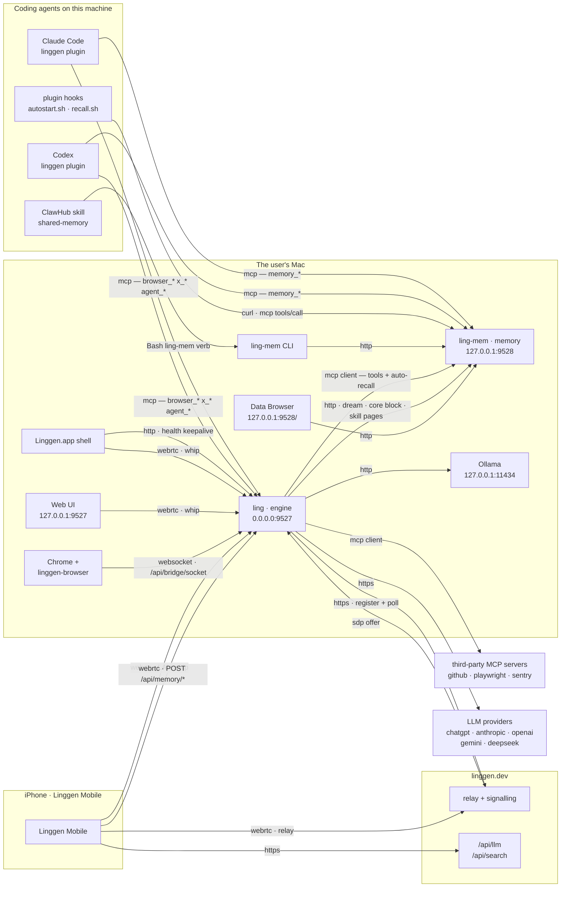

# Linggen network — who talks to whom

Two daemons on the user's machine, and everything else is a client of one of
them. Every edge below is in the shipped code; the transport on each arrow is
what actually runs, not what could. What is decided but not yet built lives in
`## Open`, never in the diagram — an arrow that doesn't run is a phantom.

**`ling` is an MCP client** (shipped 2026-07-30). It consumes any server the
user adds, and reaches memory the same way — `ling-mem` is the built-in one,
merged into `[mcp_servers]` at connect time and declared `gated: false`, so
nothing in the permission code knows its name. Auto-recall rides the same
client even though it fires *before* the model: a tool **call** is a JSON-RPC
request, and making one needs a program, not a model.

The engine still speaks REST to `ling-mem` where it is a program rather than an
agent — the dream rollup, the mission scheduler's stats, the core block,
`/apps/<skill>/capability/*` for a skill webpage's own clicks, and the phone's
`POST /api/memory/<verb>` passthrough.

**The phone reaches memory through `ling`, and must** (2026-07-30). Yinyue is
resident on the phone: her tool loop runs there, so she is the one caller that
needs this store from off-machine — and off the LAN there is no IP route to the
Mac at all, only `http_request` frames on the WebRTC channel, which terminate in
the engine's router. So `POST /api/memory/<verb>` forwards to
`[agent].ling_mem_url` and returns ling-mem's envelope whole. One route covers
all eighteen verbs; ling-mem stays the authority on which exist. The phone never
learns a port — moving `ling-mem` is a Mac-side config change and nothing else.

This is not the tool proxy cut from `/mcp` the same day. That put a second copy
of ling-mem's tools in front of a model, which then had to guess between them.
This declares no tool: no schema, no dispatch translation, one verb segment
forwarded. It is transport, like the tunnel it rides on. And the phone takes the
REST door for the reason above — three fixed verbs, choosing nothing, a program
rather than an agent.

The phone's Ling tab needs none of it: it drives a session on the Mac, and that
agent reaches memory on its own loopback like every local caller.

`memory_*` is **gone** from `ling`'s `/mcp` (2026-07-30), in the same release
that gave the plugin its second MCP entry. Each tool is served in exactly one
place. `memory_dream_status` / `memory_dream_run` stay — engine capabilities,
not memory-server ones.

## The two daemons

| | `ling` (engine) | `ling-mem` (memory) |
|:--|:--|:--|
| Binds | `0.0.0.0:9527` | `127.0.0.1:9528` — loopback unless `--host`, which is refused without paired devices |
| Address from | `[server].url` in `~/.linggen/config/linggen.runtime.toml` | compiled `daemon::DEFAULT_PORT`, or `--port` |
| Publishes where it bound | — | `~/.linggen/memory/linggen-memory/daemon.json` |
| Started by | `Linggen.app` shell (LaunchAgent), `--idle-shutdown-secs 300` | `ling-mem start`, plugin autostart, or first CLI use |
| Outbound | LLM providers, `linggen.dev` relay | none — embeddings run in-process |

The asymmetry is the source of most address bugs: **the one with a config file
publishes no discovery, and the one with discovery has no config file.** A
client of `ling` must guess its port; a client of `ling-mem` can read it but
cannot point it elsewhere.

## Edges

**Into `ling` (`:9527`)**

| From | Transport | Path |
|:--|:--|:--|
| Claude Code / Codex plugin | HTTP MCP, JSON-RPC | `/mcp` — browser, x, agents, dream |
| Linggen.app shell | HTTP | `/api/health`, every 60s while a window is open |
| Shell, Web UI, phone on LAN | WebRTC | `/api/rtc/token` → `/api/rtc/whip` |
| Phone off LAN | WebRTC over relay | `linggen.dev` signalling → `/api/signaling/<nonce>/answer` |
| linggen-browser extension | WebSocket, extension dials in | `/api/bridge/socket` |
| Skills reaching the browser | HTTP | `POST /api/bridge/call` |
| Phone, for Yinyue's memory | HTTP in the tunnel | `POST /api/memory/<verb>` → `ling-mem` |

**Into `ling-mem` (`:9528`)**

| From | Transport | Path |
|:--|:--|:--|
| `ling`, on behalf of a model | HTTP MCP, JSON-RPC | `/mcp` — the built-in server, URL from `[agent].ling_mem_url` + `/mcp` |
| `ling`, as a program | HTTP REST | `POST /api/memory/<verb>` — dream rollup, scheduler stats, core block, skill pages, the phone's passthrough |
| A second machine on the LAN | HTTP MCP, JSON-RPC | `/mcp` with `x-linggen-device` |
| `ling-mem` CLI | HTTP REST | port read from `daemon.json` |
| Plugin hooks | HTTP MCP, JSON-RPC | `/mcp` — `memory_search` per turn, `memory_list` for core, `memory_days` for upkeep |
| Plugin hooks (local only) | spawn the CLI | `ling-mem status`, `start` — daemon lifecycle, skipped on a remote host |
| ClawHub `shared-memory` skill | spawn the CLI | `Bash ling-mem <verb>` — every op, no exception |
| Browser | HTTP | `/` — the Data Browser UI |

### Four front doors to one store

| Caller | Route | Needs the engine? |
|:--|:--|:--|
| Linggen's own agents | `mcp__memory__memory_*` → `ling-mem` `/mcp` | yes |
| Outside agent via the plugin | `ling-mem` `/mcp` directly | **no** |
| ClawHub skill, plugin hooks, any agent with Bash | `ling-mem` CLI → REST | **no** |
| A second machine's agents | `ling-mem` `/mcp` + `x-linggen-device` | **no** |

The CLI route is the engine-free channel and the reason it exists: a ClawHub
user installs the skill, the skill installs the binary (`install-bin.sh
--version '^1'`), and memory works with no `ling` on the machine at all. The
same `SKILL.md` also lists `mcp__memory` in `allowed-tools`,
but that block is Linggen-only — "Claude Code / Codex ignore this block" — so
one skill file takes the engine route on Linggen and the CLI route everywhere
else.

Worth holding next to the `mcp-spec.md` line that the engine is the base
install for every channel: for the ClawHub channel today, it isn't — and the
fourth door is the case where that stops being an accident and becomes the
point. A second machine needs a URL and a token, not 107 MB of binary and a
store of its own.

**Out of the Mac**

| From | To | Why |
|:--|:--|:--|
| `ling` | provider APIs, `linggen.dev/api/llm`, local Ollama | inference |
| `ling` | `linggen.dev` | register the instance, poll for SDP offers |
| Phone | `linggen.dev/api/llm`, `/api/search` | Yinyue's model and web search |

Everything else the phone does — skills, memory, DJ files, photos, Ling's
chat — is tunnelled inside the WebRTC data channel as `http_request`, so it
works identically on the LAN and over the relay. Memory was the exception for
three days: it addressed `/mcp` for tools the engine had stopped serving, and
failed silently because the phone reads a missing `result` as "no Mac". Fixed
2026-07-30 by the passthrough above.

## `ling-mem`'s own `/mcp` — the promoted path now

It was built for outside agents first (`3df4919`, 2026-05-27: "HTTP endpoint
serving 5 memory tools to CC/Codex/Cursor") — six weeks *before* the engine had
a `/mcp` at all. `mcp-spec.md` (2026-07-10) then chose one front door for every
channel and this became the unpromoted one; **that choice was reversed on
2026-07-29**, and the reversal is written into `mcp-spec.md` itself rather than
left as a stale page asserting the opposite.

Fourteen tools, and everything is on them: the engine's own agents by its MCP
client, the plugin's Claude Code / Codex sessions by their second server entry,
the plugin's hooks by curl, and a second machine on the LAN directly. The
engine's proxy was **cut** on 2026-07-30 in the same release — each tool served
in exactly one place, which is the point.

Two tools do NOT leave `ling`: `memory_dream_status` and `memory_dream_run` are
**engine** capabilities. The first composes the daemon's rollup with the
engine's in-flight run state; the second drives the mission executor. `ling-mem`
cannot serve either. (`mcp-client-spec.md`'s blanket "`memory_*` is removed" is
wrong on exactly these two.)

The dispatch-normalisation step now lives in one place — `ling-mem`'s
`src/http/mcp.rs`. Those fixes exist because *models* fill arguments in sloppily
(`until: ""`, empty arrays narrowing to nothing); CLI arguments come from clap,
typed, from a human, and REST callers are programs. The engine's copy went with
the tools.

## Where an address comes from, today

Two different questions, and conflating them is the bug that keeps recurring:
**serve at** is a machine's declaration about its own daemon; **connect to** is
a host's declaration about where it goes looking. On the machine that runs
everything they coincide, which is exactly what makes them easy to merge by
mistake — on a second machine they are facts about different computers.

**Serve at**

| Daemon | Reads | Notes |
|:--|:--|:--|
| `ling` | `[server].url` in `linggen.runtime.toml` | `--port` / `LINGGEN_PORT` override; legacy `host`+`port` still parse and say so at startup |
| `ling-mem` | `--port` / `--host` | no config file; publishes `daemon.json` |

Nothing else asserts a bind address. The app shell and the plugin's autostart
both **read** `[server].url` and no longer pass `--port` — they used to assert
their own default, which is how a user's `[server].port` could be set and
ignored, and how the 9898 stray daemon was launched.

**Connect to**

| Client | Reads | Notes |
|:--|:--|:--|
| plugin hooks | `~/.linggen/client.json` | env > file > default, via `hooks/mcp.sh` |
| plugin `.mcp.json` | `${LINGGEN_HOST/PORT}`, `${LING_MEM_HOST/PORT}` | CC expands at startup, **before** any hook — so it can only take env; `config.sh` mirrors `client.json` into `settings.json` `env` |
| `ling` → `ling-mem` | `[agent].ling_mem_url` | full URL, so it can already point off-machine |
| `ling` `cli/status.rs` | `DEFAULT_LING_MEM_PORT` const | **no** — ignores the above |
| `ling` permission check | hardcoded `127.0.0.1:9528` | **no** |
| `ling-mem` CLI | `daemon.json` | discovery; local only by construction |
| `linggen-vscode` | its own `linggen.dashboard.port` | yes |

`linggen/src/config.rs` carries `DEFAULT_LING_MEM_PORT` with a comment saying
it must match `linggen-memory`'s `daemon::DEFAULT_PORT` — a constant
hand-synced across two repos. The 2026-07 migration from `9898` proved the
hazard: `.mcp.json` was flipped and `autostart.sh` was not, so every session
started a second daemon on a port nothing served, and both registered the same
relay instance and split the phone's traffic.

## Open

**The last restatement.** `cli/status.rs:106` still probes
`DEFAULT_LING_MEM_PORT` instead of reading `[agent].ling_mem_url`, so `ling
status` reports on a daemon the engine may not be using. (The permission check
was listed here too and shouldn't have been — it carries no ling-mem address at
all; every other `9528` in `src/` is a test literal or a doc comment.) And
`ling` still publishes no discovery file the way `ling-mem` does — which is what
a client would read to find a *running* daemon rather than a configured one.

**A second machine, end to end.** Every piece is built — the plugin's two
server entries, hooks over curl, `autostart.sh` skipping the binary on a remote
host, ling-mem's LAN gate — but nobody has yet pointed a real second machine at
this store. `LING_MEM_HOST` + `LING_MEM_TOKEN`, pair once through Linggen, and
nothing installed locally. Until that run happens it is designed and unit-true,
not proven.

**Two daemons, one relay instance.** Both registrations are accepted, and the
phone's offers are answered by whichever polls first. The second should be
refused.
