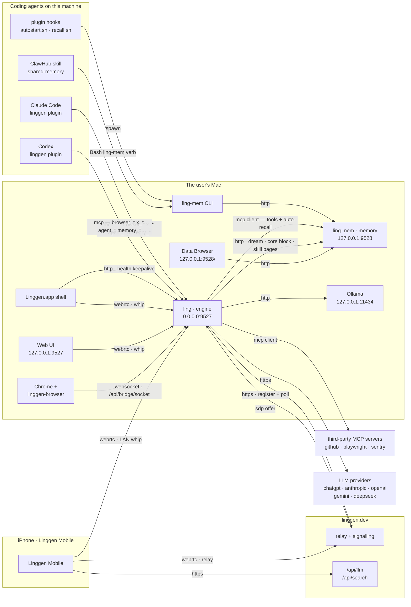

# Linggen network — who talks to whom

Two daemons on the user's machine, and everything else is a client of one of
them. Every edge below is in the shipped code; the transport on each arrow is
what actually runs, not what could. What is decided but not yet built lives in
`## Open`, never in the diagram — an arrow that doesn't run is a phantom.

**`ling` is an MCP client** (shipped 2026-07-30). It consumes any server the
user adds, and reaches memory the same way — `ling-mem` is the built-in one,
merged into `[mcp_servers]` at connect time and declared `gated: false`, so
nothing in the permission code knows its name. Auto-recall rides the same
client even though it fires *before* the model: a tool **call** is a JSON-RPC
request, and making one needs a program, not a model.

The engine still speaks REST to `ling-mem` where it is a program rather than an
agent — the dream rollup, the mission scheduler's stats, the core block, and
`/apps/<skill>/capability/*` for a skill webpage's own clicks.

`memory_*` on `ling`'s `/mcp` is **deprecated, not gone**: it has been the
outside agent's route since 1.4.0, so it stays through a window, marked
DEPRECATED in the tool list. The plugin pointing those agents at `ling-mem`
directly is the step that closes it — see `## Open`.

## The two daemons

| | `ling` (engine) | `ling-mem` (memory) |
|:--|:--|:--|
| Binds | `0.0.0.0:9527` | `127.0.0.1:9528` — loopback unless `--host`, which is refused without paired devices |
| Address from | `~/.linggen/config/linggen.runtime.toml` `[server]` | compiled `daemon::DEFAULT_PORT`, or `--port` |
| Publishes where it bound | — | `~/.linggen/memory/linggen-memory/daemon.json` |
| Started by | `Linggen.app` shell (LaunchAgent), `--idle-shutdown-secs 300` | `ling-mem start`, plugin autostart, or first CLI use |
| Outbound | LLM providers, `linggen.dev` relay | none — embeddings run in-process |

The asymmetry is the source of most address bugs: **the one with a config file
publishes no discovery, and the one with discovery has no config file.** A
client of `ling` must guess its port; a client of `ling-mem` can read it but
cannot point it elsewhere.

## Edges

**Into `ling` (`:9527`)**

| From | Transport | Path |
|:--|:--|:--|
| Claude Code / Codex plugin | HTTP MCP, JSON-RPC | `/mcp` |
| Linggen.app shell | HTTP | `/api/health`, every 60s while a window is open |
| Shell, Web UI, phone on LAN | WebRTC | `/api/rtc/token` → `/api/rtc/whip` |
| Phone off LAN | WebRTC over relay | `linggen.dev` signalling → `/api/signaling/<nonce>/answer` |
| linggen-browser extension | WebSocket, extension dials in | `/api/bridge/socket` |
| Skills reaching the browser | HTTP | `POST /api/bridge/call` |

**Into `ling-mem` (`:9528`)**

| From | Transport | Path |
|:--|:--|:--|
| `ling`, on behalf of a model | HTTP MCP, JSON-RPC | `/mcp` — the built-in server, URL from `[agent].ling_mem_url` + `/mcp` |
| `ling`, as a program | HTTP REST | `POST /api/memory/<verb>` — dream rollup, scheduler stats, core block, skill pages |
| A second machine on the LAN | HTTP MCP, JSON-RPC | `/mcp` with `x-linggen-device` |
| `ling-mem` CLI | HTTP REST | port read from `daemon.json` |
| Plugin hooks | spawn the CLI | `ling-mem search`, `days`, `status`, `start` |
| ClawHub `shared-memory` skill | spawn the CLI | `Bash ling-mem <verb>` — every op, no exception |
| Browser | HTTP | `/` — the Data Browser UI |

### Four front doors to one store

| Caller | Route | Needs the engine? |
|:--|:--|:--|
| Linggen's own agents | `mcp__memory__memory_*` → `ling-mem` `/mcp` | yes |
| Outside agent via the plugin | `ling` `/mcp` → REST — **deprecated**, see `## Open` | yes |
| ClawHub skill, plugin hooks, any agent with Bash | `ling-mem` CLI → REST | **no** |
| A second machine's agents | `ling-mem` `/mcp` + `x-linggen-device` | **no** |

The CLI route is the engine-free channel and the reason it exists: a ClawHub
user installs the skill, the skill installs the binary (`install-bin.sh
--version '^1'`), and memory works with no `ling` on the machine at all. The
same `SKILL.md` also lists `mcp__memory` in `allowed-tools`,
but that block is Linggen-only — "Claude Code / Codex ignore this block" — so
one skill file takes the engine route on Linggen and the CLI route everywhere
else.

Worth holding next to the `mcp-spec.md` line that the engine is the base
install for every channel: for the ClawHub channel today, it isn't — and the
fourth door is the case where that stops being an accident and becomes the
point. A second machine needs a URL and a token, not 107 MB of binary and a
store of its own.

**Out of the Mac**

| From | To | Why |
|:--|:--|:--|
| `ling` | provider APIs, `linggen.dev/api/llm`, local Ollama | inference |
| `ling` | `linggen.dev` | register the instance, poll for SDP offers |
| Phone | `linggen.dev/api/llm`, `/api/search` | Yinyue's model and web search |

Everything else the phone does — skills, memory, DJ files, photos, Ling's
chat — is tunnelled inside the WebRTC data channel as `http_request`, so it
works identically on the LAN and over the relay.

## `ling-mem`'s own `/mcp` — the promoted path now

It was built for outside agents first (`3df4919`, 2026-05-27: "HTTP endpoint
serving 5 memory tools to CC/Codex/Cursor") — six weeks *before* the engine had
a `/mcp` at all. `mcp-spec.md` (2026-07-10) then chose one front door for every
channel and this became the unpromoted one; **that choice was reversed on
2026-07-29**, and the reversal is written into `mcp-spec.md` itself rather than
left as a stale page asserting the opposite.

Fourteen tools, and everything of ours is on them: the engine's own agents by
its MCP client, and a second machine on the LAN directly. What remains on the
engine's `/mcp` is a deprecation window for the outside agents that have used
that route since 1.4.0 — the tools are still served, marked DEPRECATED, and the
mark is derived from the backend so a new memory tool cannot join the group and
miss it.

Two tools do NOT leave: `memory_dream_status` and `memory_dream_run` are
**engine** capabilities. The first composes the daemon's rollup with the
engine's in-flight run state; the second drives the mission executor. `ling-mem`
cannot serve either, so they stay on `ling`'s front door after the window
closes. (`mcp-client-spec.md`'s blanket "`memory_*` is removed" is wrong on
exactly these two.)

The dispatch-normalisation step now lives in one place — `ling-mem`'s
`src/http/mcp.rs`. Those fixes exist because *models* fill arguments in sloppily
(`until: ""`, empty arrays narrowing to nothing); CLI arguments come from clap,
typed, from a human, and REST callers are programs. The engine's copy went with
the tools.

## Where an address comes from, today

| Consumer | Reads | Overridable |
|:--|:--|:--|
| `ling` server bind | `linggen.runtime.toml` `[server]` | yes |
| plugin `.mcp.json` | hardcoded `127.0.0.1:9527` | **no** |
| plugin `autostart.sh` | `LINGGEN_PORT`, default `9527` | env only |
| `ling` → `ling-mem` (MCP + REST) | `[agent].ling_mem_url` | yes |
| `ling` `cli/status.rs` | `DEFAULT_LING_MEM_PORT` const | **no** — ignores the above |
| `ling` permission check | hardcoded `127.0.0.1:9528` | **no** |
| `ling-mem` CLI | `daemon.json` | n/a — discovery |
| `linggen-vscode` | its own `linggen.dashboard.port` | yes |

`linggen/src/config.rs` carries `DEFAULT_LING_MEM_PORT` with a comment saying
it must match `linggen-memory`'s `daemon::DEFAULT_PORT` — a constant
hand-synced across two repos. The 2026-07 migration from `9898` proved the
hazard: `.mcp.json` was flipped and `autostart.sh` was not, so every session
started a second daemon on a port nothing served, and both registered the same
relay instance and split the phone's traffic.

## Open

**One source of truth for addresses.** Resolution order for every consumer:
env → a shared `endpoints.toml` → the daemon's own discovery file → compiled
default. `ling` should write a discovery file the way `ling-mem` already does,
`.mcp.json` should use `${LINGGEN_PORT:-9527}` expansion (supported in `url`),
and the hardcoded constants should read rather than restate.

**The plugin's second MCP entry.** The daemon side is done; the plugin still
ships one entry pointing at `ling` `:9527`. Two entries — `ling` for
`browser_*` / `x_*` / `agent_*`, `ling-mem` for `memory_*` — is what closes the
deprecation window, and what lets a second machine's Claude Code recall with
**no `ling-mem` binary at all**: the CLI resolves through `daemon.json`, which
can only ever describe a *local* daemon, so a CLI-based remote recall would
need its own binary, daemon and store — which forks the user's memory.

**`recall.sh` over MCP.** A hook can't *be* a model's tool call, but it can
*make* one — `curl` posting JSON-RPC. The rows come back carrying
`hybrid_score`, `score` and `contexts`, so the one thing the MCP schema
withholds (`min_score`, deliberately — a model guessing a threshold narrows
recall to zero) becomes a client-side `jq` filter the script is already shaped
to do. Follow-on: `autostart.sh` should skip installing and starting the binary
on a read-only remote host.

**Two daemons, one relay instance.** Both registrations are accepted, and the
phone's offers are answered by whichever polls first. The second should be
refused.
